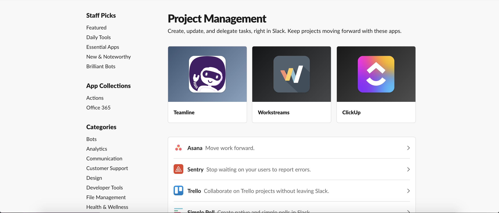

# HTML and CSS Lab

### Deliverables
* In your termial, write `open index.html` to open the html file in your terminal
* Open `index.html` and `styles.css` in your code editor
* Use a combination of HTML and CSS to try and recreate a layout similar to this page (you can use your own placeholders for the images):

### Resources:
* Flex Box: https://developer.mozilla.org/en-US/docs/Learn/CSS/CSS_layout/Flexbox
* Image Tags: https://developer.mozilla.org/en-US/docs/Web/HTML/Element/img
* Fonts: https://developer.mozilla.org/en-US/docs/Web/CSS/font

